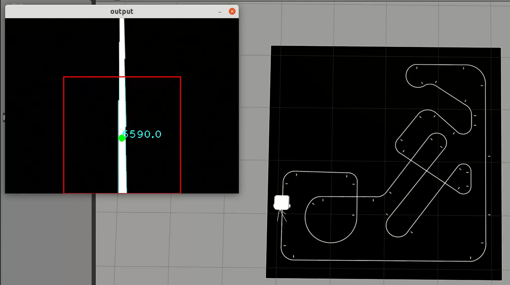
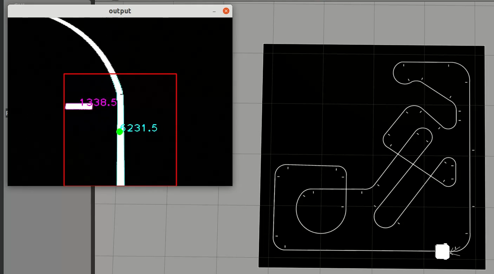
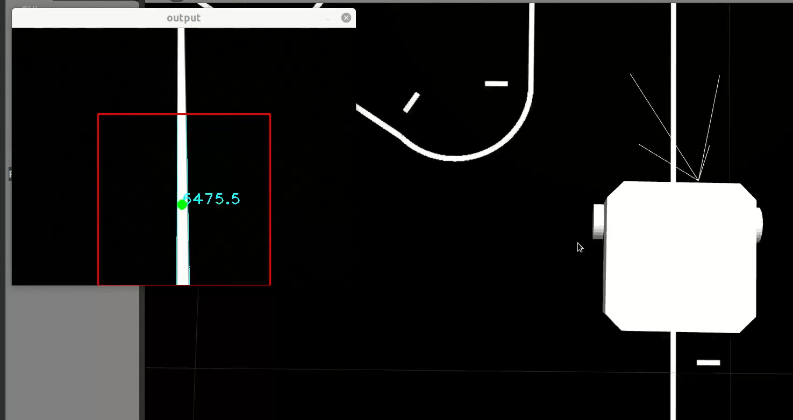

## ROS2 Line Follower

### Control a ROS2 differential drive robot to run in a Robotrace course using OpenCV.

### Use it on your own robot, or try out the demo using a custom-made simulation on Gazebo.

## Installation:
#### (Requires a ROS2 distribution)

* Clone this repository in your ROS2 workspace
* Rename it as `follower`
* Build the package (`colcon build --symlink-install`)

## Launching the simulation:
#### (Requires both `gazebo_ros` and `turtlebot3_gazebo` ROS2 packages)

* Add `follower/models` to your `$GAZEBO_MODEL_PATH` environment variable
* Launch the simulation (`ros2 launch follower new_track.launch.py`)

## Running the line follower node: 
#### (Requires both `cv2` and `cv_bridge` python libraries)

* Run the node (`ros2 run follower follower_node`)
* Start the robot (`ros2 service call /start_follower std_srvs/srv/Empty`)

Please check [docs/about.md](/docs/about.md) for more information.

## Special thanks to:
* The authors of `Programming Robots with ROS: A Practical Introduction to the Robot Operating System` (and reference code in https://github.com/osrf/rosbook)
* @ROBOTIS programmers for their work in https://github.com/ROBOTIS-GIT/turtlebot3_simulations, licensed under Apache License 2.0 by ROBOTIS CO., LTD.
* [Yapira UFPR](https://www.facebook.com/ufpr.yapira) Robotics Team for the inspiration and support
* Prof. Eduardo Todt for letting me use this package as the final project of his "Mobile Robotics" course at UFPR.
